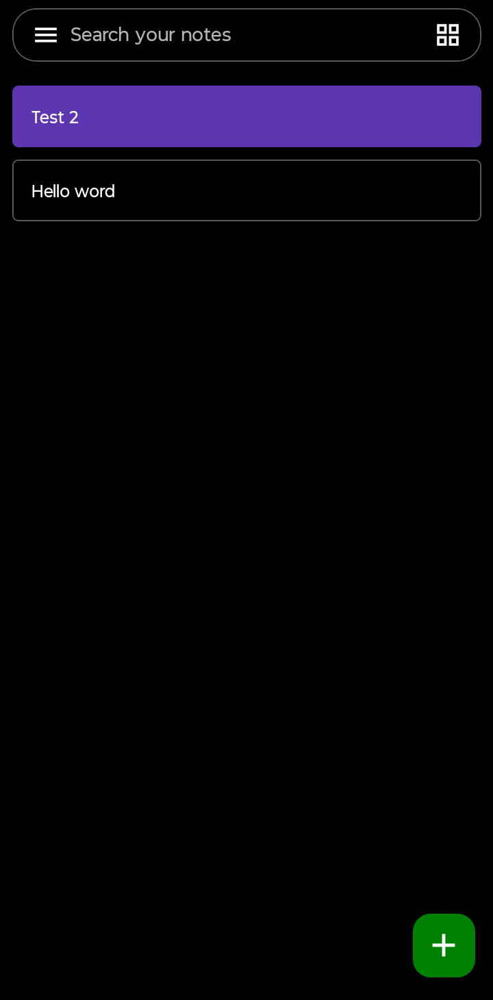
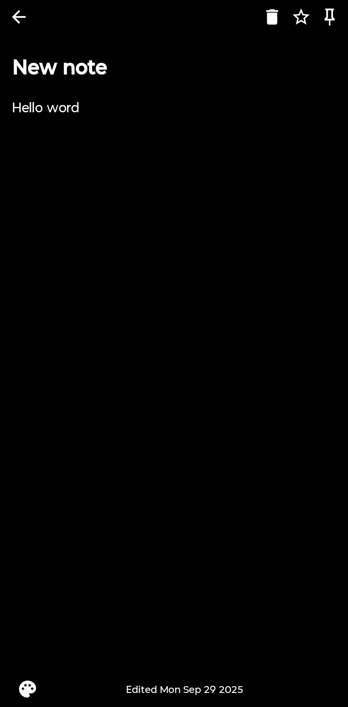
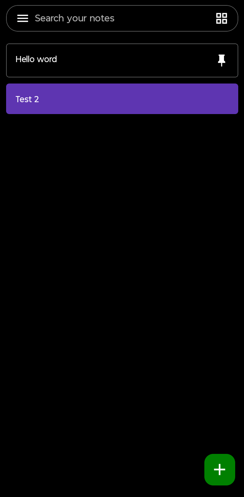

# Stack Notes
A basic notes app.

# Screenshots
## Home

## Create note

## Favorites

## Pinned

# Installation

> **Note**: Make sure you have completed the [Set Up Your Environment](https://reactnative.dev/docs/set-up-your-environment) guide before proceeding.


## 1. Clone the repository.
```sh
git clone git@github.com:ismaelvr1999/StackNotes.git
```

## 2. Install Dependencies.

```sh
cd StackNotes
npm install
```

## 3. Build and run your app

### Android

```sh
npm run start # start dev server 

npm run android # install app 
```

### iOS
**WARNING**: This app has not been tested on iOS yet.

For iOS, remember to install CocoaPods dependencies (this only needs to be run on first clone or after updating native deps).

The first time you create a new project, run the Ruby bundler to install CocoaPods itself:

```sh
bundle install
```

Then, and every time you update your native dependencies, run:

```sh
bundle exec pod install
```

```sh
# Using npm
npm run ios

# OR using Yarn
yarn ios
```